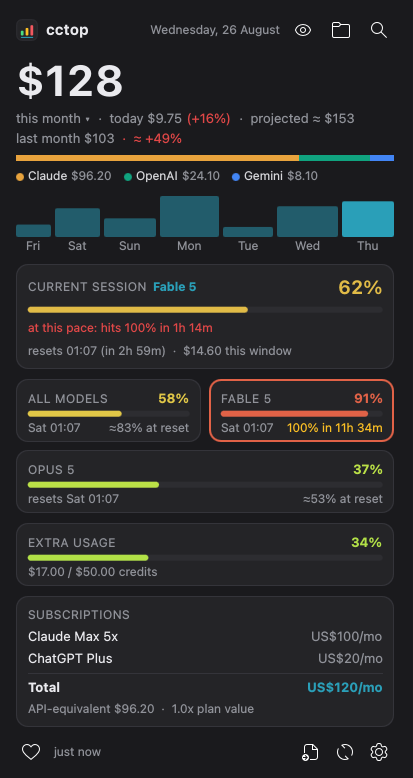
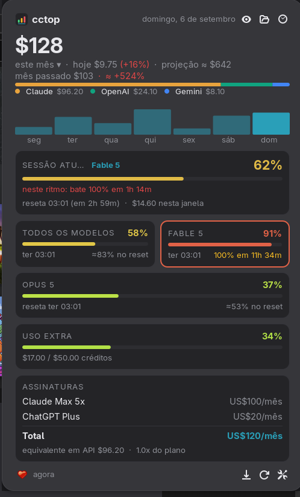

# cctop

[](https://store.kde.org/browse?search=cctop)
[](https://github.com/nventatech/cctop/releases)
[](https://kde.org/plasma-desktop/)
[](https://extensions.gnome.org/)
[](LICENSE)

<p>


</p>

AI usage and cost monitor for the KDE Plasma panel and the GNOME Shell top
bar. Shows live Claude Code session limits, monthly spend per provider and
your subscriptions. All data is local: no accounts, no API keys, no
telemetry.

Both versions share the same collectors and show the same popup. Pick the one
for your desktop:

| Desktop | Package | Where |
|---|---|---|
| KDE Plasma 6 | plasmoid | `plasma/`, [KDE Store](https://store.kde.org/browse?search=cctop) |
| GNOME Shell 48 to 50 | extension | `gnome/`, extensions.gnome.org (under review) |

## ✨ Features

- **Panel indicator** — live Claude session usage % (green → yellow → red),
  today's spend or subscriptions total (configurable). Scroll on it to cycle
  session % / weekly % / spend today / subscriptions / reset countdown
- **Spend** per provider with stacked bar and legend; click the big number to
  switch its window (this month, today, last 7 days, last 30 days). Today shows
  the delta against yesterday
- **End-of-month projection** — run rate from the month so far, tinted by how
  it compares to your budget
- **Last month comparison** — previous month total and the projected delta
- **Top projects & by-model breakdown** — where the money went this month,
  behind the folder button in the popup header
- **Last 7 days** and **last 6 months** bar charts
- **Live limits** — current 5h session (%, reset time, model in use), weekly
  all-models limit and one card per model-scoped limit, straight from the same
  endpoint the Claude Code `/usage` command uses (via the OAuth token the CLI
  already stores locally). The limit that is currently biting is outlined
- **Pace warning** — when the current burn rate hits 100% before the window
  resets, the session and weekly cards say how long you have left; otherwise
  the weekly cards show where the usage lands at the reset
- **Codex quota** — Codex writes its own rate limit windows into its session
  logs, so the popup shows one card per window (5h, weekly) with percentage,
  reset time and pace, alongside the Claude cards. No request and no cookies;
  the tradeoff is that it only refreshes when `codex` actually runs
- **Extra usage credits** — usage credits card when the account has them on
- **Recent sessions** — last sessions with model and cost
- **Subscription auto-detection** — your Claude plan (Pro / Max 5x / Max 20x /
  Team) and your ChatGPT plan (Plus / Pro / Team / Business, from the Codex CLI
  login) are read from local CLI files
- **Extra subscriptions** — add any other fixed AI cost in the settings, one
  per line (`Cursor Pro: 20`)
- **Plan value** — this month's Claude usage at API rates next to what the
  plan costs
- **Monthly budget** — optional limit with progress bar and notifications at
  80% and 100%
- **Privacy mode** — the eye button masks every money value (panel included)
- **Desktop notifications** when the session or the weekly limits cross a
  configurable threshold, again at 95% and 100%, when the pace is set to
  overshoot the window, when the account is locked out of a window, and when
  such a window resets
- **CSV export** of the last 30 days per day and model (footer button)
- **Morning summary** — optional systemd timer with yesterday's spend, the
  7-day total and the weekly limit (see below)
- **Follow the system theme** — optional, for light desktops
- **Languages**: English, Português (Brasil), Español

### 🔌 Providers

| Provider | Source | Status |
|---|---|---|
| Claude (Claude Code) | local JSONL logs + local OAuth token | full |
| OpenAI (Codex CLI) | local session logs (`~/.codex`) — cost and rate limit windows | best effort |
| Gemini (Gemini CLI) | local telemetry log (`~/.gemini`) | best effort |

Providers appear automatically when their CLI is used on the machine.

Best effort means the reader was written from the log format and tested with
synthetic fixtures only — the per-model cost may be off. Reports with a real
log sample are welcome.

## 📋 Requirements

- KDE Plasma 6, or GNOME Shell 48 to 50
- `jq`, `curl`
- [ccusage](https://github.com/ryoppippi/ccusage): `bun add -g ccusage` (or
  `npm i -g ccusage`). Without it the widget falls back to `bunx`/`npx`, which
  needs network access on every run
- [Claude Code](https://claude.com/claude-code) for the Claude data

## 📦 Install

### KDE Plasma

From the KDE Store: right-click your panel → *Add Widgets* → *Get New Widgets* → search **cctop**.

Manual:

```sh
git clone https://github.com/nventatech/cctop.git
kpackagetool6 --type Plasma/Applet --install cctop/plasma
```

Then add the **cctop** widget to your panel.

### GNOME Shell

From extensions.gnome.org: search **cctop** in the Extensions app or on the
site, once the review is through.

Manual:

```sh
git clone https://github.com/nventatech/cctop.git
cd cctop && gnome/build.sh
gnome-extensions install dist/cctop-gnome-*.zip
```

Log out and back in, then enable **cctop** in the Extensions app. The
indicator sits in the top bar.

## ⚙️ Configuration

Click the big number to switch its window (month, today, 7 days, 30 days).
The export button in the footer writes `~/cctop-<date>.csv` with the last
30 days per day and model.

Settings: right-click the widget → *Configure cctop* on KDE, the gear button
in the popup footer on GNOME. Language, what the panel label shows,
notification threshold, monthly budget, extra subscriptions, popup colors and
refresh interval.

## 🌅 Morning summary (optional)

`shared/code/summary.sh` sends a desktop notification with yesterday's
spend, the 7-day total and your weekly limit usage. To get it every morning,
create a systemd user timer. Use the `ExecStart` line for your desktop:

```ini
# ~/.config/systemd/user/cctop-summary.service
[Unit]
Description=cctop morning AI cost summary

[Service]
Type=oneshot
ExecStartPre=-/usr/bin/nm-online -q -t 30
# KDE
ExecStart=%h/.local/share/plasma/plasmoids/com.nventatech.cctop/contents/code/summary.sh
# GNOME
# ExecStart=%h/.local/share/gnome-shell/extensions/cctop@nventatech/code/summary.sh
Restart=on-failure
RestartSec=60
```

```ini
# ~/.config/systemd/user/cctop-summary.timer
[Unit]
Description=cctop morning AI cost summary at 08:00

[Timer]
OnCalendar=*-*-* 08:00
Persistent=true

[Install]
WantedBy=timers.target
```

```sh
systemctl --user enable --now cctop-summary.timer
```

## 🗂 Repository layout

- `shared/` — collectors (`fetch.sh`, `export.sh`, `summary.sh`), icons and
  images used by both packages
- `plasma/` — the Plasma 6 widget
- `gnome/` — the GNOME Shell extension (`gnome/build.sh` packs it)
- `tests/` — collector and helper tests for both (`bash tests/run.sh`)

## ❤️ Donate

If cctop is useful to you, you can support it through the heart button in the widget, the PayPal button below or the QR code:

[](https://www.paypal.com/donate/?business=SR28XBBCYSPHE&no_recurring=0&item_name=Help+me+buy+a+coffee.&currency_code=USD)


## 📄 License

[GPL-3.0-or-later](LICENSE) — © 2026 NventaTech
