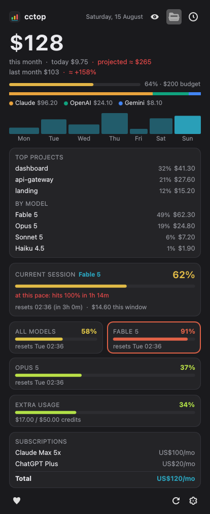

# cctop

[](https://store.kde.org/browse?search=cctop)
[](https://github.com/nventatech/cctop/releases)
[](https://kde.org/plasma-desktop/)
[](LICENSE)



AI usage and cost monitor for the KDE Plasma panel. Shows live Claude Code
session limits, monthly spend per provider and your subscriptions. All data
is local: no accounts, no API keys, no telemetry.

## ✨ Features

- **Panel indicator** — live Claude session usage % (green → yellow → red),
  today's spend or subscriptions total (configurable)
- **Monthly spend** per provider with stacked bar and legend
- **End-of-month projection** — run rate from the month so far, tinted by how
  it compares to your budget
- **Last month comparison** — previous month total and the projected delta
- **Top projects & by-model breakdown** — where the money went this month,
  behind the folder button in the popup header
- **Last 7 days** and **last 6 months** bar charts
- **Live limits** — current 5h session (%, reset time, model in use), weekly
  all-models limit and one card per model-scoped limit, straight from the same
  endpoint the Claude Code `/usage` command uses (via the OAuth token the CLI
  already stores locally). The limit that is currently biting is outlined
- **Pace warning** — when the current burn rate hits 100% before the 5h window
  resets, the session card says how long you have left
- **Extra usage credits** — usage credits card when the account has them on
- **Recent sessions** — last sessions with model and cost
- **Subscription auto-detection** — your Claude plan (Pro / Max 5x / Max 20x)
  and your ChatGPT plan (Plus / Pro / Team, from the Codex CLI login) are read
  from local CLI files
- **Extra subscriptions** — add any other fixed AI cost in the settings, one
  per line (`Cursor Pro: 20`)
- **Monthly budget** — optional limit with progress bar and a notification
  when the spend crosses it
- **Privacy mode** — the eye button masks every money value (panel included)
- **Desktop notification** when the session or the weekly limits cross a
  configurable threshold
- **Scroll on the panel widget** to cycle session % / weekly % / spend today /
  subscriptions / reset countdown
- **Follow the system theme** — optional, for light Plasma desktops
- **Languages**: English, Português (Brasil), Español

### 🔌 Providers

| Provider | Source |
|---|---|
| Claude (Claude Code) | local JSONL logs + local OAuth token |
| OpenAI (Codex CLI) | local session logs (`~/.codex`) |
| Gemini (Gemini CLI) | local telemetry log (`~/.gemini`) |

Providers appear automatically when their CLI is used on the machine.

## 📋 Requirements

- KDE Plasma 6
- `jq`, `curl`
- [ccusage](https://github.com/ryoppippi/ccusage): `bun add -g ccusage` (or
  `npm i -g ccusage`). Without it the widget falls back to `bunx`/`npx`, which
  needs network access on every run
- [Claude Code](https://claude.com/claude-code) for the Claude data

## 📦 Install

From the KDE Store: right-click your panel → *Add Widgets* → *Get New Widgets* → search **cctop**.

Manual:

```sh
git clone https://github.com/nventatech/cctop.git
kpackagetool6 --type Plasma/Applet --install cctop
```

Then add the **cctop** widget to your panel.

## ⚙️ Configuration

Click the big number to switch its window (month, today, 7 days, 30 days).
The export button in the footer writes `~/cctop-<date>.csv` with the last
30 days per day and model.

Right-click the widget → *Configure cctop*: language, what the panel label
shows, notification threshold, monthly budget, extra subscriptions, popup
colors and refresh interval.

## 🌅 Morning summary (optional)

`contents/code/summary.sh` sends a desktop notification with yesterday's
spend, the 7-day total and your weekly limit usage. To get it every morning,
create a systemd user timer:

```ini
# ~/.config/systemd/user/cctop-summary.service
[Unit]
Description=cctop morning AI cost summary

[Service]
Type=oneshot
ExecStartPre=-/usr/bin/nm-online -q -t 30
ExecStart=%h/.local/share/plasma/plasmoids/com.nventatech.cctop/contents/code/summary.sh
Restart=on-failure
RestartSec=60
```

```ini
# ~/.config/systemd/user/cctop-summary.timer
[Unit]
Description=cctop morning AI cost summary at 08:00

[Timer]
OnCalendar=*-*-* 08:00
Persistent=true

[Install]
WantedBy=timers.target
```

```sh
systemctl --user enable --now cctop-summary.timer
```

## ❤️ Donate

If cctop is useful to you, you can support it through the heart button in the widget, the PayPal button below or the QR code:

[](https://www.paypal.com/donate/?business=SR28XBBCYSPHE&no_recurring=0&item_name=Help+me+buy+a+coffee.&currency_code=USD)


## 📄 License

[GPL-3.0-or-later](LICENSE) — © 2026 NventaTech
